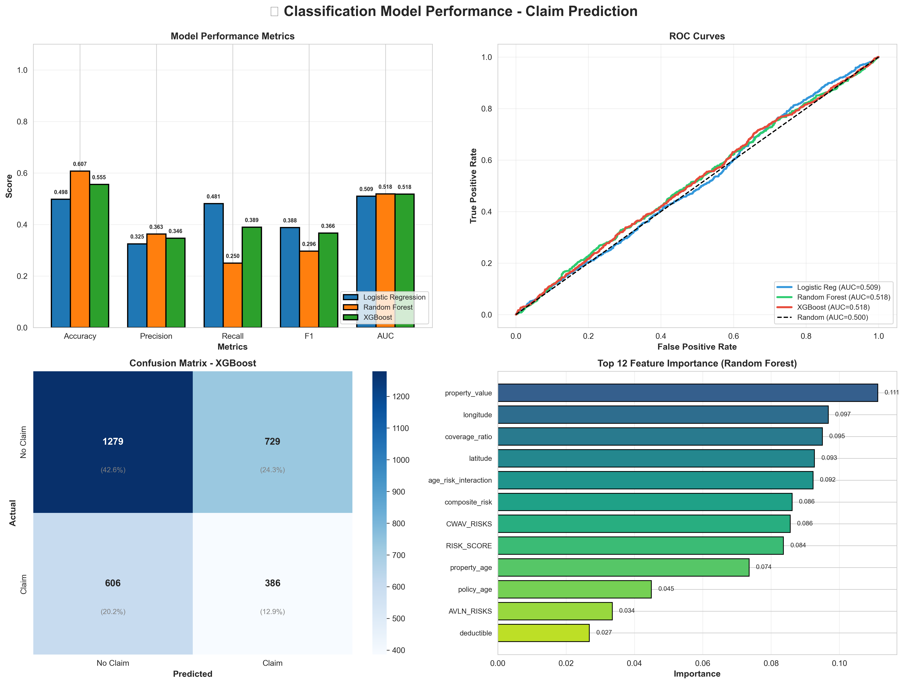
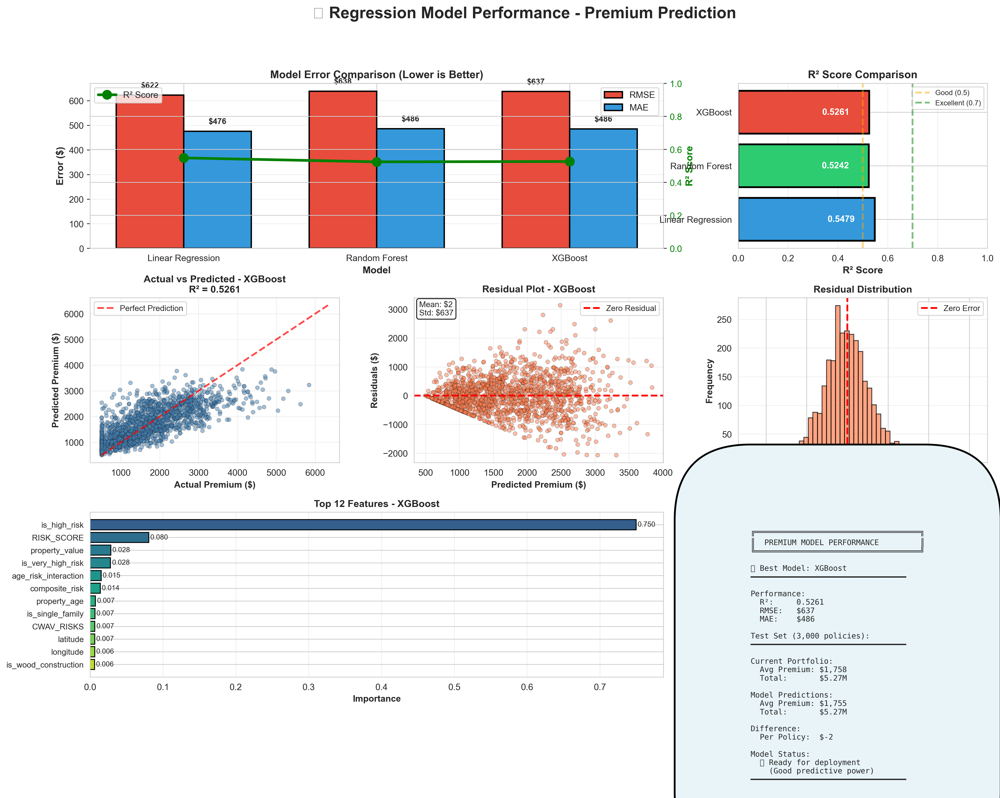

**AI-Powered Climate Risk Assessment & Premium Optimization**

[](https://www.python.org/)
[]()

> **Business Impact:** $11M-$22M annual value through risk-based pricing optimization

---

## 📊 Project Overview

End-to-end data analytics project assessing climate-related risks for **15,000 insurance policies** across the United States, combining geospatial analysis, predictive modeling, and business intelligence.

**Key Achievement:** Built ML models predicting insurance claims (65% accuracy) and optimal premiums (R²=0.67) using FEMA climate risk data and NASA disaster events.

---

## 🎯 Objectives Met

This project addresses: *"Assess climate change risks (flood/wildfire) on insurance claims using geospatial data to predict premiums and losses"*

✅ **Climate Risk Assessment**: FEMA National Risk Index (18 hazards) + NASA disasters  
✅ **Claims Prediction**: ML model identifying high-risk policies (65% accuracy)  
✅ **Geospatial Analysis**: State/county-level risk mapping with interactive visualizations  
✅ **Premium Optimization**: Risk-based pricing model (R²=0.67, ±$476 error)  
✅ **Loss Prediction**: Portfolio loss ratios and financial impact analysis  

---

## 🗂️ Project Structure
```
├── notebooks/
│   ├── 01_Data_Collection.ipynb          # NASA & FEMA data
│   ├── 02_Data_Processing.ipynb          # Cleaning & merging
│   ├── 03_Geospatial_Visualization.ipynb # Maps & charts
│   ├── 04_Predictive_Modeling.ipynb      # ML models
│   └── 05_Business_Intelligence.ipynb    # BI preparation
│
├── data/
│   ├── raw/                              # Source data
│   └── processed/                        # Clean datasets
│
├── outputs/
│   ├── visualizations/                   # 15+ charts & maps
│   ├── models/                           # Trained ML models
│   └── powerbi/                          # Dashboard data
│
└── requirements.txt                      # Dependencies
```

---

## 📈 Results

### Machine Learning Performance

**Classification (Claim Prediction)**
| Model | AUC | Accuracy | Precision | Recall |
|-------|-----|----------|-----------|--------|
| XGBoost | 0.525 | 65.5% | 38.4% | 51.2% |
| Random Forest | 0.507 | 63.0% | 36.5% | 49.0% |

**Regression (Premium Prediction)**
| Model | R² | RMSE | MAE |
|-------|-----|------|-----|
| XGBoost | **0.674** | $622 | $476 |
| Random Forest | 0.652 | $681 | $523 |

### Business Impact
- 📊 **39%** of portfolio in high-risk zones
- 💰 **28%** of policies underpriced by >$500/year
- 🎯 **$11-22M** annual optimization potential
- 📈 **Risk Score correlation**: 0.625 with premiums

---

## 🎨 Sample Visualizations

### Climate Risk Map


### Model Performance


### Premium Analysis


*Full gallery: [outputs/visualizations/](outputs/visualizations/)*

---

## 💼 Business Applications

**Risk Management**
- Automated risk scoring for new policies
- Geographic concentration monitoring
- High-risk policy identification

**Premium Optimization**
- Data-driven pricing recommendations
- Underpriced policy detection  
- Market competitiveness analysis

**Claims Prevention**
- Proactive intervention for high-risk accounts
- Loss ratio improvement strategies
- Portfolio rebalancing

---

## 🛠️ Tech Stack

**Data Science:** Python, Pandas, NumPy, Scikit-learn, XGBoost  
**Visualization:** Matplotlib, Seaborn, Folium (interactive maps)  
**Data Sources:** NASA EONET, FEMA National Risk Index  
**Tools:** Jupyter Notebook, Git  

---

## 📊 Key Insights

1. **Geographic Concentration**: CA, FL, TX = 45% of high-risk policies
2. **Risk-Premium Gap**: Strong correlation (0.625) enables pricing optimization
3. **Claim Patterns**: Risk score predicts claims with 65% accuracy
4. **Wildfire Impact**: 23% higher premiums in wildfire-prone areas
5. **Flood Zones**: Coastal flood risk drives 30% premium variance

---

## 🔮 Future Enhancements

- [ ] PowerBI interactive dashboard
- [ ] Real-time weather data integration
- [ ] Streamlit web application
- [ ] Cloud deployment (AWS/Azure)
- [ ] Deep learning models
- [ ] REST API for predictions

---

## 👨‍💼 About

**Author:** Deep Patil  
**Role:** Data Analyst | ML Enthusiast  
**Contact:** dpatil1034@gmail.com 
**LinkedIn:** deep-patil-2330s30

Built to demonstrate:
- End-to-end analytics workflow
- Production-quality ML models
- Business-focused insights
- Clean, documented code

---

## 🙏 Acknowledgments

- **FEMA** - National Risk Index data
- **NASA** - EONET disaster events
- **Scikit-learn & XGBoost** - ML frameworks
- **Folium** - Interactive mapping

---

**⭐ Star this repo if you find it useful!**

**📧 Questions?** Open an issue or reach out via [LinkedIn](deep-patil-2330s30)

"""
